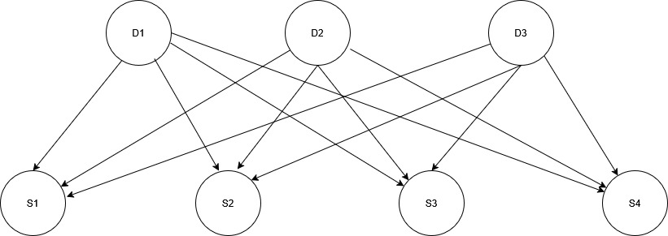

# Disease finding expert system
This is a small expert, system which task is to predict the probability of user having each disease, based on their symptoms. This system implements bayes net in order to calculate compound probability of the disease based on prior probability of having it and on probability of disease developing given symptoms. It's a more complicated version of expert system from previous lab.

# How it works?
System utilizes simple bayes net, that looks like this:

The image is a simplified version, because my system takes into consideration:
- 6 diseases (D nodes):
    - gripe (flu),
    - resfriado comun (common cold),
    - alergia (allergy),
    - amigdalitis,
    - bronquitis,
    - neumonia (Pneumonia).
- 10 symptoms (S nodes):
    - fiebre (fever),
    - tos (cough),
    - dolor de garganta (sore throat),
    - congestion nasal (nasal congestion),
    - estornudos (sneezing),
    - picazon en los ojos (itchy eyes),
    - dificultad para tragar (difficulty swallowing),
    - flema (phlegm),
    - dificultad para respirar (difficulty breathing),
    - dolor de pecho (chest pain).

System utilizes Bayes' theorem to calculate the probability of having disease:

$$P(D|S_1,S_2,...,S_n)  = \frac{ (\sum_{i=1}^n P(S_i|D))P(D)}{P(S_1,S_2,...,S_n)}$$

Where:

$$P(S_1,S_2,...,S_n) = \sum_{i=1}^n P(S|D_i)P(D_i)$$